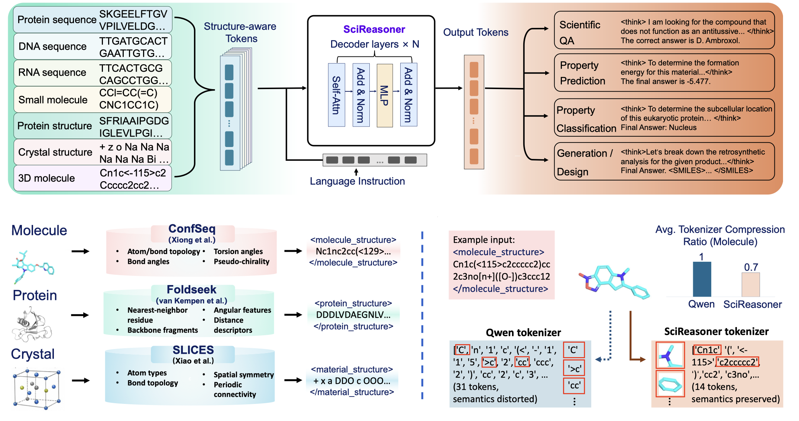
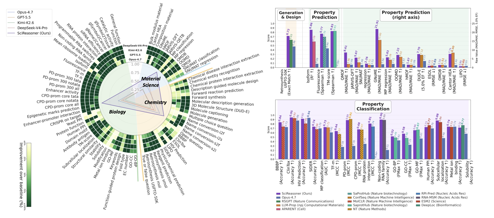
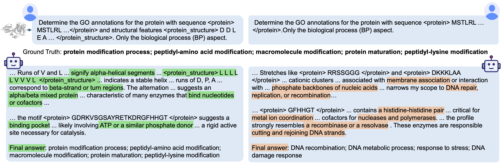
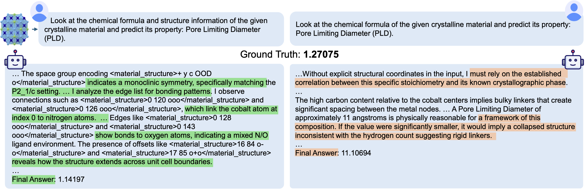

<h1 align="center">SciReasoner</h1>

<p align="center">
  <strong>Structure-aware scientific foundation model for proteins, molecules, nucleic acids, and materials.</strong>
</p>

<p align="center">
  <a href="https://arxiv.org/abs/2607.07708"></a>
  <a href="https://scireasoner.github.io"></a>
  <a href="https://github.com/SpectrAI-Initiative/SciReasoner"></a>
  
  
</p>

SciReasoner is a multimodal scientific foundation model for native structural reasoning. It turns protein structures, 3D molecules, crystals, sequences, formulas, and text into structure-aware evidence tokens, then reasons over those tokens for scientific QA, prediction, classification, and generation/design tasks.

## Highlights

- **Broad benchmark leadership:** state-of-the-art on **67 / 86** evaluated tasks and best-performing model against generalist LLM baselines on **75 / 86** tasks.
- **Specialist-level accuracy:** matches or surpasses published domain specialists on **26 / 33** specialist-baseline comparisons.
- **Native structural reasoning:** uses Foldseek 3Di, ConfSeq, and SLICES structural encodings instead of relying only on text serialization.
- **Cross-domain scope:** covers proteins, DNA/RNA, small molecules, 3D molecular structures, and inorganic crystals in one model.
- **Inspectable traces:** double-blind experts rated SciReasoner traces as preferred or comparable to DeepSeek-V4-Pro in **98%** of judgments.

## News

- **2026-07-08:** SciReasoner preprint released on arXiv: [arXiv:2607.07708](https://arxiv.org/abs/2607.07708).

## Model

SciReasoner is initialized from Qwen3-14B and aligned with domain-native structural vocabularies. Structural tokens are treated as addressable evidence units, allowing the model to connect residues, fragments, conformers, symmetry, coordination environments, and periodic bonding patterns to downstream scientific properties.

<p align="center">
  
</p>

## Model Scope

| Area | Inputs | Task coverage |
| --- | --- | --- |
| Chemistry / small molecules | SMILES, IUPAC names, molecular formulas, text descriptions/questions, ConfSeq 3D molecular tokens | Scientific QA and extraction: chemical entity recognition, chemical-protein interaction extraction, chemical-disease interaction extraction, multiple-choice, true/false, open QA, name conversion, molecular description generation, molecule captioning; property prediction: ESOL, DUD-E, LIPO, physicochemical prediction; classification: BBBP, ClinTox, HIV Prediction, SIDER; generation/design: forward synthesis, forward reaction prediction, reagent prediction, retrosynthesis mol/USPTO-50K/smol, molecule generation, description-guided molecule design. |
| Materials | chemical formulas/compositions, text descriptions, crystal structures/CIF-derived descriptions, SLICES tokens | Property prediction: MP regression, SNUMAT regression, JARVIS-DFT, JARVIS-QETB, GNoME, hMOF, Cantor HEA, QMOF, OQMD, OMDB; classification: MP classification, SNUMAT classification; generation/design: composition material, bulk modulus material. |
| Protein biology | amino-acid sequences, text descriptions/functional annotations, Foldseek 3Di protein-structure tokens | Scientific QA: Function, General function; property prediction: fluorescence, stability, structural similarity, TM-score; classification/annotation: solubility, antibody-antigen interaction, yeast/human PPI, protein function, domain motif, fold type, subcellular localization, EC number, keywords, metal ion binding, GO-BP, GO-CC, GO-MF; generation/design: function-guided protein design, catalytic activity. |
| DNA/RNA and genomics | nucleotide sequences, text descriptions, gene/sequence metadata | Property prediction: enhancer activity, isoform, mean ribosome loading, programmable RNA switches, CRISPR on target, siRNA efficiency; classification: gSymbol2Tissue, gName2Cancer, gSymbol2Cancer, RNA protein interaction, epigenetic marks, TF-m, TF-h, enhancer-promoter interaction, PD-prom 300 all/notata/tata, CPD-prom core all/notata/tata, non-coding RNA family, modification. |

## Evaluation

Evaluation scripts and processed benchmark configs will be added with the public code release. The figure and specialist table below report the paper results across generalist and specialist comparisons.

<p align="center">
  
</p>

### Full Specialist-Baseline Results

| Category | Task | Metric | Specialist baseline | SciReasoner |
| --- | --- | --- | --- | --- |
| Generation & Design | Retrosynthesis USPTO-50K | Exact Match ↑ | 0.63 RSGPT | **0.72** |
| Prediction | Fluorescence | Spearman ↑ | 0.70 SaprotHub | **0.77** |
| Prediction | Isoform | R2 ↑ | 0.59 APARENT | **0.86** |
| Prediction | TM-score | Spearman ↑ | **0.83** SaprotHub | **0.83** |
| Prediction | ESOL | RMSE ↓ | 1.11 MolCLR | **1.03** |
| Prediction | GNoME | MAD/MAE ↑ | 15.60 LLM-Prop | **21.91** |
| Prediction | QMOF | MAD/MAE ↑ | 1.96 LLM-Prop | **8.61** |
| Prediction | MP regression | MAD/MAE ↑ | 4.39 LLM-Prop | **5.83** |
| Prediction | JARVIS-DFT | MAD/MAE ↑ | 2.91 LLM-Prop | **5.67** |
| Prediction | SNUMAT regression | MAD/MAE ↑ | 1.51 LLM-Prop | **2.26** |
| Prediction | hMOF | MAD/MAE ↑ | 1.48 LLM-Prop | **1.67** |
| Prediction | OQMD | MAD/MAE ↑ | 6.02 LLM-Prop | **7.22** |
| Prediction | OMDB | MAD/MAE ↑ | **1.51** LLM-Prop | 1.50 |
| Prediction | DUD-E | 5.0% EF ↑ | 7.12 ConfSeq | **7.70** |
| Prediction | Cantor HEA | MAD/MAE ↑ | **8.40** LLM-Prop | 7.79 |
| Prediction | LIPO | RMSE ↓ | **0.65** MolCLR | 0.80 |
| Classification | BBBP | ACC ↑ | 0.74 MolCLR | **0.84** |
| Classification | ClinTox | ACC ↑ | 0.93 MolCLR | **0.95** |
| Classification | HIV Prediction | ACC ↑ | 0.81 MolCLR | **0.92** |
| Classification | SIDER | ACC ↑ | 0.68 MolCLR | **0.74** |
| Classification | MP classification | AUC ↑ | 0.72 LLM-Prop | **0.73** |
| Classification | TF-m | MCC ↑ | 0.57 NT | **0.64** |
| Classification | PD-prom 300 all | MCC ↑ | **0.91** NT | 0.89 |
| Classification | CPD-prom core all | MCC ↑ | 0.67 NT | **0.68** |
| Classification | RNA protein interaction | MCC ↑ | 0.74 RPI-Pred | **0.81** |
| Classification | Non-coding RNA family | ACC ↑ | 0.89 RNA-MSM | **0.90** |
| Classification | GO-BP | Fmax ↑ | 0.49 SaprotHub | **0.52** |
| Classification | GO-CC | Fmax ↑ | 0.48 SaprotHub | **0.58** |
| Classification | GO-MF | Fmax ↑ | **0.67** SaprotHub | 0.66 |
| Classification | Human PPI | ACC ↑ | **0.77** ESM2 | 0.73 |
| Classification | Subcellular localization | ACC ↑ | 0.84 ESM2 | **0.88** |
| Classification | Metal ion binding | ACC ↑ | 0.73 ESM2 | **0.74** |
| Classification | Solubility | ACC ↑ | **0.77** DeepLoc | 0.72 |

## Reasoning Examples

SciReasoner is designed to expose intermediate structural evidence, not only final predictions.

### Protein Function Annotation

<p align="center">
  
</p>

Structure-aware prompting lets the model reason over secondary-structure segments, binding-pocket evidence, and motif-level cues before predicting protein function.

### Materials Property Prediction

<p align="center">
  
</p>

For crystalline materials, SciReasoner can use space-group information, atom-index connectivity, unit-cell boundaries, and bonding patterns to support property estimates.

## Citation

If you find SciReasoner useful, please cite:

```bibtex
@misc{tang2026scireasoner,
  title={Accurate, Interdisciplinary and Transparent Structure-property Understanding with Deep Native Structural Reasoning},
  author={Tang, Chen and Wang, Yizhou and Wu, Jianyu and Wang, Lintao and Tang, Shixiang and Li, Pengze and Su, Encheng and Yao, Jun and Xiao, Jiabei and Shi, Yuqi and Li, Jielan and Hao, Hongxia and Gao, Zhangyang and Wu, Fang and Fei, Ben and Yue, Xiangyu and Tan, Pan and Zhong, Bozitao and Zhang, Jinouwen and Wang, Aoran and Lu, Yan and Liu, Jiaheng and Ma, Xinzhu and Hong, Liang and Zheng, Mingyue and Torr, Phil and Zhou, Bowen and Ouyang, Wanli and Bai, Lei},
  year={2026},
  eprint={2607.07708},
  archivePrefix={arXiv},
  primaryClass={cs.CL},
  url={https://arxiv.org/abs/2607.07708}
}
```

## Contact

For updates, visit [scireasoner.github.io](https://scireasoner.github.io) or follow this repository.
